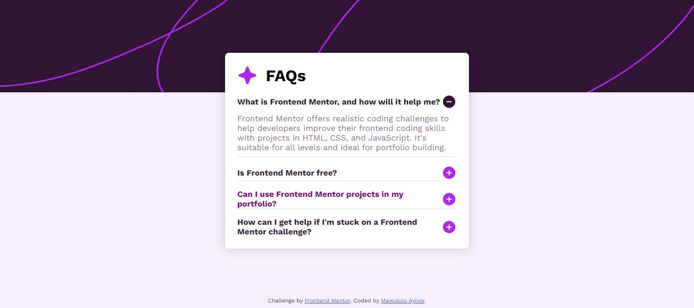

# Frontend Mentor - FAQ accordion solution

This is a solution to the [FAQ accordion challenge on Frontend Mentor](https://www.frontendmentor.io/challenges/faq-accordion-wyfFdeBwBz). Frontend Mentor challenges help you improve your coding skills by building realistic projects. 

## Table of contents

- [Overview](#overview)
  - [The challenge](#the-challenge)
  - [Screenshot](#screenshot)
  - [Links](#links)
- [My process](#my-process)
  - [Built with](#built-with)
  - [What I learned](#what-i-learned)
  - [Continued development](#continued-development)
  - [Useful resources](#useful-resources)
- [Author](#author)
- [Acknowledgments](#acknowledgments)

**Note: Delete this note and update the table of contents based on what sections you keep.**

## Overview

### The challenge

Users should be able to:

- Hide/Show the answer to a question when the question is clicked
- Navigate the questions and hide/show answers using keyboard navigation alone
- View the optimal layout for the interface depending on their device's screen size
- See hover and focus states for all interactive elements on the page

### Screenshot

### Links

- Solution URL: [solution](https://your-solution-url.com)
- Live Site URL: [live site](https://lolontor.github.io/faq-accordion-main/)

## My process
First, I statred with the structing of my accordion page with html5 
I followed with styling with CSS3 to get enough styled page to add the button functionality
I then used JavaScript to add the click event to the accordion sections.
Then finally I finished up with completing the rest of the styling of the accordion.

### Built with

- Semantic HTML5 markup
- CSS custom properties
- Flexbox
- Mobile-first workflow
- Javascript

### What I learned
During this challenge, I really learnt a lot. I was able to use JavaScript on my website to change to appearance of a paricular section when the user click on a question. Also I was able to notice that my Javascript fundamentals needed more attention. I learnt I am not ready to take on JavaScript included challanges yet.

### Continued development

- JavaScript fundamentals.
- JavaScript for frontend development.

### Useful resources

- [OnlinelTtuts Tutorials](https://www.youtube.com/@OnlinelTtuts) - This tutorial helped me with the use of JavaScript to add and remove classes from and html elemet.
- [CSS-Tricks](https://www.css-tricks.com) - I got more understanding of css properties from this site.
- [Stack Overflow](https://www.stackoverflow.com) - I was able to get resolve some of my bugs by reading feedbacks from the Stack Overflow community.

## Author

- Frontend Mentor - [@Lolontor](https://www.frontendmentor.io/profile/Lolontor)
- freeCodeCamp - [@elolontor](https://www.freecodecamp.org/elolontor)
- linkedin - [@Mawulolo Kwame](https://www.linkedin.com/in/mawulolo-kwame-b54a171a1)
- github - [@Lolontor](https://github.com/Lolontor)

## Acknowledgments

I will like to thank the frontend challenge team for putting up such a wonderful challenges to help individuals master frontend development. Also, I am greatful for Kevin Powell who always mention frontend mentor in most of his tutorials so I decided to check it up. Thank you.

